# 🏠 Smart Housing Valuation Predictor

<div align="center">


[](https://www.python.org/downloads/)
[](https://scikit-learn.org/)
[](https://pandas.pydata.org/)
[](https://opensource.org/licenses/MIT)

**An intelligent machine learning system that predicts housing values using advanced regression techniques**

[🚀 Quick Start](#-quick-start) • [📊 Features](#-features) • [🛠️ Installation](#️-installation) • [📈 Usage](#-usage) • [🔧 Configuration](#-configuration)

</div>

---

## 🎯 Overview

The Smart Housing Valuation Predictor is a sophisticated machine learning application that leverages Random Forest Regression to accurately predict median house values based on various socioeconomic and geographical features. Built with scikit-learn and featuring automated pipeline processing, this tool provides reliable housing market insights.

### 🌟 Key Highlights

```mermaid
graph TB
    A[📊 Raw Housing Data] --> B[🔄 Data Preprocessing]
    B --> C[📏 Feature Scaling]
    C --> D[🎯 Stratified Sampling]
    D --> E[🌳 Random Forest Training]
    E --> F[💾 Model Persistence]
    F --> G[🔮 Price Predictions]
    
    style A fill:#e1f5fe
    style B fill:#f3e5f5
    style C fill:#e8f5e8
    style D fill:#fff3e0
    style E fill:#fce4ec
    style F fill:#f1f8e9
    style G fill:#e0f2f1
```



---

## ✨ Features

<table>
<tr>
<td width="50%">

### 🤖 Machine Learning Pipeline
- **Automated preprocessing** with robust imputation
- **Feature scaling** and normalization
- **Stratified sampling** for balanced training
- **Random Forest Regression** for accurate predictions

</td>
<td width="50%">

### 🔧 Production Ready
- **Model persistence** with joblib serialization  
- **Intelligent training/inference** mode detection
- **CSV-based** input/output interface
- **Error-resistant** pipeline architecture

</td>
</tr>
</table>

### 📊 Supported Features

| Feature Type | Examples | Processing |
|--------------|----------|------------|
| **Numerical** | `longitude`, `latitude`, `housing_median_age`, `total_rooms`, `total_bedrooms`, `population`, `households`, `median_income` | Median imputation + StandardScaler |
| **Categorical** | `ocean_proximity` | One-hot encoding |

---

## 🚀 Quick Start

### Prerequisites

```bash
# Ensure you have Python 3.7+ installed
python --version
```

### Installation

```bash
# Clone the repository
git clone https://github.com/aniruddha92003/Smart-Housing-Valuation-Predictor.git
cd Smart-Housing-Valuation-Predictor

# Install dependencies
pip install pandas numpy scikit-learn joblib
```

### 🎬 Demo

```python
# Training Phase (First Run)
python housing_predictor.py
# Output: "Model trained and saved."

# Inference Phase (Subsequent Runs)
python housing_predictor.py
# Output: "Inference complete. Results saved to output.csv"
```

---

## 📈 Usage

### 📝 Data Format

Your `housing.csv` should contain the following columns:

<details>
<summary><b>📋 Required Columns</b></summary>

```
longitude              # Geographical longitude
latitude               # Geographical latitude  
housing_median_age     # Median age of housing units
total_rooms           # Total number of rooms
total_bedrooms        # Total number of bedrooms
population            # Population count
households            # Number of households
median_income         # Median income (in tens of thousands)
median_house_value    # Target variable (what we predict)
ocean_proximity       # Categorical: proximity to ocean
```

</details>

### 🔄 Workflow


---

## 🏗️ Architecture

### 🧠 Model Pipeline

<div align="center">

```
┌─────────────────┐    ┌──────────────────┐    ┌─────────────────┐
│  Raw Features   │ ──▶│   Preprocessing  │ ──▶│ Random Forest   │
│                 │    │                  │    │   Regressor     │
│ • Numerical     │    │ • Median Imputer │    │                 │
│ • Categorical   │    │ • Standard Scaler│    │ • n_estimators  │
│                 │    │ • OneHot Encoder │    │ • random_state  │
└─────────────────┘    └──────────────────┘    └─────────────────┘
```

</div>

### 🔧 Key Components

#### 1. **Data Preprocessing Pipeline**
```python
def build_pipeline(num_attribs, cat_attribs):
    # Numerical features: Imputation → Scaling
    # Categorical features: One-hot encoding
    # Combined with ColumnTransformer
```

#### 2. **Stratified Sampling**
- Creates balanced train/test splits based on income categories
- Ensures representative sampling across income brackets
- Prevents bias in model evaluation

#### 3. **Model Persistence**
- Automatic model and pipeline serialization
- Seamless switching between training and inference modes
- Production-ready deployment capability

---

## 📊 Performance Insights

### 🎯 Model Characteristics

| Aspect | Details |
|--------|---------|
| **Algorithm** | Random Forest Regression |
| **Features** | 8 numerical + 1 categorical |
| **Sampling** | Stratified by income quintiles |
| **Preprocessing** | Robust imputation + scaling |
| **Persistence** | Joblib serialization |

### 📈 Expected Benefits

```diff
+ High accuracy through ensemble learning
+ Robust handling of missing values
+ Automatic feature importance ranking
+ Resistance to overfitting
+ Fast inference times
```

---

## 🔧 Configuration

### 🛠️ Customization Options

<details>
<summary><b>⚙️ Advanced Configuration</b></summary>

```python
# Modify these parameters in the script:

# Random Forest Parameters
RandomForestRegressor(
    n_estimators=100,           # Number of trees
    random_state=42,            # Reproducibility
    max_depth=None,             # Tree depth
    min_samples_split=2,        # Min samples to split
    min_samples_leaf=1          # Min samples per leaf
)

# Stratified Split Parameters  
StratifiedShuffleSplit(
    n_splits=1,                 # Number of splits
    test_size=0.2,              # Test set proportion
    random_state=42             # Reproducibility
)
```

</details>

### 📁 File Structure

```
Smart-Housing-Valuation-Predictor/
│
├── 📄 housing_predictor.py     # Main script
├── 📊 housing.csv              # Training data (required)
├── 🤖 model.pkl               # Trained model (auto-generated)
├── ⚙️ pipeline.pkl             # Preprocessing pipeline (auto-generated)
├── 📥 input.csv               # Test data (auto-generated)
├── 📤 output.csv              # Predictions (auto-generated)
└── 📖 README.md               # This file
```

---

## 🚀 Getting Started

### Step 1: Prepare Your Data
```bash
# Ensure housing.csv contains all required columns
# Place it in the project root directory
```

### Step 2: Train the Model
```bash
# First run - trains and saves the model
python housing_predictor.py
```

### Step 3: Make Predictions
```bash
# Subsequent runs - loads model and predicts
python housing_predictor.py
```

### Step 4: Analyze Results
```bash
# Check output.csv for predictions
# Column 'median_house_value' contains predicted values
```

---

## 📄 License

This project is licensed under the MIT License - see the [LICENSE](LICENSE) file for details.

---

## 👨‍💻 Author

<div align="center">

**[Aniruddha](https://github.com/aniruddha92003)**

[](https://github.com/aniruddha92003)

*Building intelligent solutions for real-world problems* 🚀

</div>

---

<div align="center">

### 🌟 Star this repository if you found it helpful!

**Made with ❤️ and lots of ☕**

</div>
