# 🏠 Smart Housing Valuation Predictor

<div align="center">


*An intelligent machine learning system for accurate housing price prediction*

[🚀 Quick Start](#-quick-start) •
[📊 Features](#-features) •
[🛠️ Installation](#️-installation) •
[📈 Usage](#-usage) •
[🤖 Model](#-model-details)

</div>

---

## 📋 Overview

The **Smart Housing Valuation Predictor** leverages advanced machine learning techniques to provide accurate housing price predictions. Built with a robust Random Forest algorithm and sophisticated data preprocessing pipelines, this tool helps estimate median house values based on various housing characteristics.

<details>
<summary><b>🎯 Key Highlights</b></summary>

- **Intelligent Data Processing**: Automated handling of missing values and categorical features
- **Stratified Sampling**: Ensures representative training data distribution
- **Production-Ready**: Persistent model storage with joblib serialization
- **Flexible Pipeline**: Seamless switching between training and inference modes
- **Scalable Architecture**: Clean separation of concerns for easy maintenance

</details>

---

## 🔄 Workflow

```mermaid
graph TD
    A[📊 Housing Data] --> B{Model Exists?}
    B -->|No| C[🔄 Training Mode]
    B -->|Yes| D[🎯 Inference Mode]
    
    C --> E[📈 Stratified Split]
    E --> F[🧹 Data Preprocessing]
    F --> G[🌲 Random Forest Training]
    G --> H[💾 Save Model & Pipeline]
    
    D --> I[📥 Load Model & Pipeline]
    I --> J[🔧 Transform Input Data]
    J --> K[🎯 Generate Predictions]
    K --> L[📤 Output Results]
    
    H --> M[✅ Ready for Inference]
    L --> N[📊 Predicted Values]
    
    style A fill:#e1f5fe
    style C fill:#f3e5f5
    style D fill:#e8f5e8
    style N fill:#fff3e0
```



---

## ✨ Features

<table>
<tr>
<td width="50%">

### 🧠 **Machine Learning**
- **Random Forest Regressor** for robust predictions
- **Stratified sampling** for balanced datasets
- **Cross-validation ready** architecture

</td>
<td width="50%">

### 🛠️ **Data Processing**
- **Automated imputation** for missing values
- **Standard scaling** for numerical features  
- **One-hot encoding** for categorical data

</td>
</tr>
<tr>
<td width="50%">

### 🏗️ **Architecture**
- **Pipeline-based** preprocessing
- **Modular design** for easy extension
- **Persistent storage** with joblib

</td>
<td width="50%">

### 📊 **Data Handling**
- **CSV input/output** support
- **Automatic mode detection**
- **Income categorization** for stratification

</td>
</tr>
</table>

---

## 🛠️ Installation

### Prerequisites

```bash
# Python 3.7 or higher required
python --version
```

### Dependencies

```bash
# Install required packages
pip install pandas numpy scikit-learn joblib
```

### Alternative: Requirements File

<details>
<summary>Create and use requirements.txt</summary>

```txt
pandas>=1.3.0
numpy>=1.21.0
scikit-learn>=1.0.0
joblib>=1.0.0
```

```bash
pip install -r requirements.txt
```

</details>

---

## 📈 Usage

### 🎯 Training Mode (First Run)

Place your `housing.csv` file in the project directory and run:

```python
python housing_predictor.py
```

**Expected Output:**
```
Model trained and saved.
```

**Files Generated:**
- `model.pkl` - Trained Random Forest model
- `pipeline.pkl` - Data preprocessing pipeline  
- `input.csv` - Test dataset for validation

---

### 🔮 Inference Mode (Subsequent Runs)

Ensure `input.csv` contains the data you want predictions for:

```python
python housing_predictor.py
```

**Expected Output:**
```
Inference complete. Results saved to output.csv
```

**Result:** `output.csv` with predicted `median_house_value` column added.

---

## 📊 Data Schema

<details>
<summary><b>📋 Input Features</b></summary>

| Feature | Type | Description |
|---------|------|-------------|
| `longitude` | Numerical | Geographic longitude coordinate |
| `latitude` | Numerical | Geographic latitude coordinate |
| `housing_median_age` | Numerical | Median age of houses in the area |
| `total_rooms` | Numerical | Total number of rooms |
| `total_bedrooms` | Numerical | Total number of bedrooms |
| `population` | Numerical | Area population count |
| `households` | Numerical | Number of households |
| `median_income` | Numerical | Median household income |
| `ocean_proximity` | Categorical | Distance/relation to ocean |

</details>

<details>
<summary><b>🎯 Target Variable</b></summary>

| Feature | Type | Description |
|---------|------|-------------|
| `median_house_value` | Numerical | Median house value in USD |

</details>

---

## 🤖 Model Details

<div align="center">

### 🧩 Architecture Components

</div>

```python
# Numerical Pipeline
SimpleImputer(strategy="median") → StandardScaler()

# Categorical Pipeline  
OneHotEncoder(handle_unknown="ignore")

# Combined Processing
ColumnTransformer → RandomForestRegressor
```

### 🔧 **Configuration**

| Component | Configuration |
|-----------|---------------|
| **Imputation Strategy** | Median for numerical features |
| **Scaling** | StandardScaler normalization |
| **Encoding** | One-hot encoding with unknown handling |
| **Algorithm** | Random Forest Regressor |
| **Random State** | 42 (for reproducibility) |
| **Stratification** | Based on income categories |

---

## 📁 Project Structure

```
smart-housing-predictor/
│
├── 📄 housing_predictor.py    # Main application script
├── 📊 housing.csv            # Training dataset
├── 📥 input.csv              # Input data for predictions  
├── 📤 output.csv             # Results with predictions
├── 🤖 model.pkl              # Trained model (auto-generated)
├── 🔧 pipeline.pkl           # Preprocessing pipeline (auto-generated)
└── 📖 README.md              # Project documentation
```

---

## 🚀 Quick Start

1. **Clone the repository**
   ```bash
   git clone https://github.com/aniruddha92003/smart-housing-valuation-predictor.git
   cd smart-housing-valuation-predictor
   ```

2. **Install dependencies**
   ```bash
   pip install pandas numpy scikit-learn joblib
   ```

3. **Add your data**
   ```bash
   # Place your housing.csv file in the project directory
   ```

4. **Run the predictor**
   ```bash
   python housing_predictor.py
   ```

---

## 🔍 Advanced Usage

<details>
<summary><b>🎛️ Customization Options</b></summary>

### Modify Income Categories
```python
# Edit the income categorization bins
housing['income_cat'] = pd.cut(housing["median_income"], 
                               bins=[0.0, 2.0, 4.0, 6.0, np.inf], 
                               labels=[1, 2, 3, 4])
```

### Adjust Model Parameters
```python
# Customize Random Forest settings
model = RandomForestRegressor(
    n_estimators=200,
    max_depth=15,
    random_state=42
)
```

### Change Test Split Ratio
```python
# Modify the train-test split percentage
split = StratifiedShuffleSplit(n_splits=1, test_size=0.3, random_state=42)
```

</details>

---

## 📊 Performance Monitoring

<details>
<summary><b>📈 Evaluation Metrics</b></summary>

To evaluate model performance, add these metrics to your workflow:

```python
from sklearn.metrics import mean_squared_error, r2_score, mean_absolute_error

# Calculate metrics
mse = mean_squared_error(y_true, y_pred)
r2 = r2_score(y_true, y_pred)
mae = mean_absolute_error(y_true, y_pred)

print(f"MSE: {mse:.2f}")
print(f"R² Score: {r2:.3f}")  
print(f"MAE: {mae:.2f}")
```

</details>

---

## 🤝 Contributing

Contributions are welcome! Please feel free to submit a Pull Request.

### 📋 Development Setup

1. Fork the repository
2. Create a feature branch (`git checkout -b feature/amazing-feature`)
3. Commit your changes (`git commit -m 'Add amazing feature'`)
4. Push to the branch (`git push origin feature/amazing-feature`)
5. Open a Pull Request

---


## 👨‍💻 Author

**Aniruddha** - [@aniruddha92003](https://github.com/aniruddha92003)

---

<div align="center">

### ⭐ If this project helped you, please give it a star!

**[⬆ Back to Top](#-smart-housing-valuation-predictor)**
